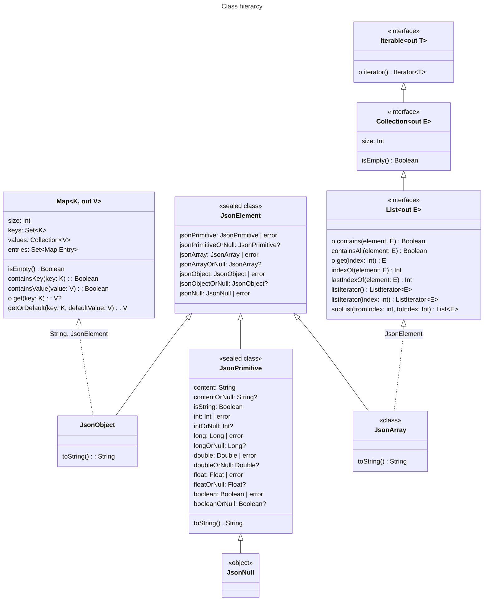

# Existing data modeler

This reverse engineering tool analyzes gathered data, stores schema, visualizes and models it to data classes.

## Usage

`./modeler` command arguments:

1. Action:
   - `all` By default analyzes, updates schema, visualizes and generates data classes.
   - `analyze` Analyzes and updates schema.
2. Input directory (defaults to working directory) or file.
   - Supported file extensions:
     - [ ] `.csv` Comma-Separated Values (CSV)
     - [ ] `.json` JavaScript Object Notation (JSON) Array
     - [ ] `.jsonl` JavaScript Object Notation (JSON) Lines
3. Output name (defaults to input directory of file name)
   - Stores schema to `<name>.json`
   - Visualizes schema to `<name>.html`
   - Generates serializable Kotlin data classes to `<name>.kt`

## Commands

- `gradlew dependencyUpdates --no-configuration-cache --no-parallel -Dorg.gradle.warning.mode=none` - Report updates
- `gradlew wrapper --gradle-version 9.5.1 --distribution-type all` - Update Gradle wrapper
- `gradlew spotlessApply --no-configuration-cache` - Format Kotlin source

## JSON modeler

Detects structure of JSON files.

Terms

- aggregate = ready or increasing sum of JSON tree
- observe = add one observation
- promote = Widen node to a more generic one
- merge = combine two aggregates to a single aggregate

### JSON structure

#### Element

##### Object

##### Array

##### String

##### Number

##### Boolean

##### Null

### JSON Data Type Color Mapping and Logic

This document defines the color coding logic for visualizing JSON data structures. The palette is designed to be intuitive for developers, drawing inspiration from popular IDE syntax highlighting themes (like VS Code and Monokai), while supporting dynamic, programmatic color manipulation for complex data representations.

#### 1. Base Color Palette

The core data types are assigned distinct, highly recognizable base colors. We use the RGB model as the foundation to allow for natural, light-based additive mixing later.

- **String:** **Orange / Amber** (`#CE9178` / `rgb(206, 145, 120)`)
- _Reasoning:_ Universally used for strings in VS Code's default Dark+ theme. It is warm, highly readable, and distinctly separates textual data from structural or numerical data.
- **Number:** **Light Green** (`#B5CEA8` / `rgb(181, 206, 168)`)
- _Reasoning:_ Green is the standard syntax color for numerical values across dozens of popular themes. It provides a strong, cool-toned contrast to the warm string color.
- **Boolean:** **Blue** (`#569CD6` / `rgb(86, 156, 214)`)
- _Reasoning:_ Blue is heavily associated with keywords and reserved constants (`true`, `false`) in most modern IDEs.
- **Object:** **Magenta / Purple** (`#C586C0` / `rgb(197, 134, 192)`)
- _Reasoning:_ Purple is often used for control flows, classes, and complex structural definitions. It visually groups key-value pairs without clashing with the actual data values.
- **Array:** **Cyan / Teal** (`#4EC9B0` / `rgb(78, 201, 176)`)
- _Reasoning:_ Cyan is frequently used for types, interfaces, and collections. It creates a clear distinction between an associative structure (Object) and an indexed list (Array).
- **Null:** **Black** (`#000000` / `rgb(0, 0, 0)`)
- _Reasoning:_ Represents the absolute absence of data or color.

#### 2. Subtypes (Color Variations)

When a base type is narrowed down into a specific subtype (e.g., Number -> Float), the visual representation remains anchored to the base color but undergoes a slight shift in **Hue (H)** or **Saturation (S)** using the HSL color space.

- **Logic:** Adjust the hue angle by ±15 to 20 degrees, or alter the saturation, keeping the lightness constant.
- **Example (Numbers):**
- _Integer (Base Number):_ Standard Light Green.
- _Float:_ Shift hue slightly towards blue (e.g., a cooler, minty green) to indicate added complexity (decimals).
- _Decimal/BigInt:_ Shift hue slightly towards yellow (a warmer green) to indicate larger memory allocation or high precision.

#### 3. Nesting Logic (Depth Visualization)

To visualize nested structures (e.g., an Array inside an Object), the color becomes progressively lighter to simulate an element coming "closer" to the surface of the screen or catching more light.

- **Logic:** For every level of nesting depth ($d$), increase the **Lightness (L)** value in the HSL color model by a fixed percentage (e.g., +5% or +10% per level), up to a maximum threshold (e.g., 90%) to ensure it doesn't become completely white and lose its base hue.
- **Formula Concept:** `L_new = min(90%, L_base + (depth_level * step_percentage))`
- _Example:_ A base Object (Purple) at depth 0 has 60% lightness. An Object nested inside it (depth 1) will be rendered at 70% lightness, making it a distinctly paler purple.

#### 4. Dynamic Types / Unions (Additive Mixing)

When a data field can accept multiple types (e.g., `String | Number`), or represents a dynamic field, the color is calculated using **additive color mixing**—mirroring how natural light works.

- **Logic:** Sum the individual RGB channels of the constituent types. Since we are adding light, the resulting color will naturally pull towards White (`#FFFFFF`).
- **Algorithm:**
  `R_mixed = min(255, R1 + R2 + ...)`
  `G_mixed = min(255, G1 + G2 + ...)`
  `B_mixed = min(255, B1 + B2 + ...)`
- _Example:_ A field that is a union of **Boolean (Blue)** and **Number (Green)** will sum their RGB values. The additive mix of Blue light and Green light naturally produces a vibrant **Cyan**, moving closer to white the more types are added. If a field accepts _all_ types (Any/Dynamic), the sum of all distinct base colors will effectively result in **White**, perfectly representing a completely open spectrum of data.

## [Kotlin Serialization](https://github.com/Kotlin/kotlinx.serialization)

- [Kotlin Serialization Guide](https://github.com/Kotlin/kotlinx.serialization/blob/master/docs/serialization-guide.md)
  - [Json elements](https://github.com/Kotlin/kotlinx.serialization/blob/master/docs/json.md#json-elements)
- [API Reference](https://kotlinlang.org/api/kotlinx.serialization/)

- `error` = `IllegalArgumentException`

### Check order

1. `is JsonNull` -> `NullData`
2. `is JsonPrimitive`
   1. `isString` -> `StringData`
   2. `booleanOrNull != null` -> `BooleanData`
   3. `NumberData`
3. `is JsonArray` -> `ArrayData`
4. `is JsonObject` -> `ObjectData`

### TODO

- Support [JsonNames](https://kotlinlang.org/api/kotlinx.serialization/kotlinx-serialization-json/kotlinx.serialization.json/-json-names/)
- Count zeros especially millis
